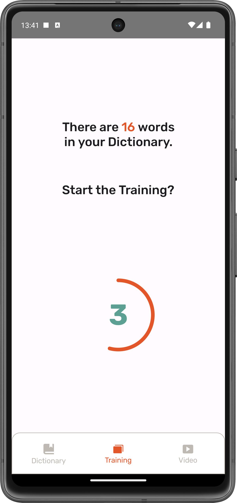

# WordsFactory

### Expand your lexicon effortlessly

Android app for learning and memorizing new words quickly

## Architecture

WordsFactory is a multi-module project that follow
the [google modularization pattern](https://developer.android.com/topic/modularization/patterns#types-of-modules).

The project is divided into 14 modules:

- **Feature modules**
    - A feature is an isolated part of an app's functionality that usually corresponds to a screen or series of closely
      related screens, like a sign up or checkout flow. If your app has a bottom bar navigation, it’s likely that each
      destination is a feature.
- **Data modules**
    - A data module usually contains a repository, data sources and model classes. The three primary responsibilities of
      a data module are:
    - Encapsulate all data and business logic of a certain domain: Each data module should be responsible for handling
      data that represents a certain domain. It can handle many types of data as long as they are related.
- **Common modules**
    - A common module is a module that contains code that is shared across multiple other modules. This can include code
      that is shared across the entire app, or code that is shared across a subset of modules.

## Tech Stack

- **Dependency Injection**
    - Dagger-Hilt
    - Dagger-2
- **Network**
    - Retrofit
- **Data store**
    - Room
    - Data Store
- **UI**
    - Jetpack Compose
- **Asynchronous**
    - Coroutines
- **Testing**
    - JUnit
    - Mockk
- **Presentation-Layer pattern**
    - MVVM

## Screenshots

#### OnBoarding Section

#### Auth Section

#### Dictionary Section

  
  

#### Training Section

  
  
  
  

#### Video Section

  

#### Widget Section

  

